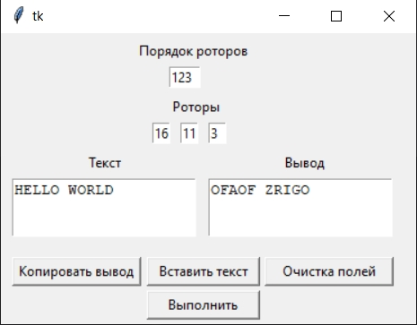
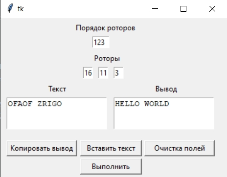

# Software implementation of the Enigma cipher.
**This code is a virtual implementation of the Enigma cipher machine with three different rotors. The input data is plain text, the order of the selected rotors and the initially set values of the rotors.**

<div align="center">
  
  
  

  [Text encryption](#text-encryption) •  
  [Text decryption](#text-decryption) • 
  
</div>

#

For this software implementation to work, 2 libraries are needed: *tkinter* and *pyperclip*.

*tkinter* is a built-in library from the python 3 version, if you do not have it for some reason, then you can install it using the following command:

```sh
pip3 install tkinter
```

*pyperclip* must be installed with the following console command:

```sh
pip3 install pyperclip
```

#

# Text encryption.

Let's choose the order of the roots, the rotors can be repeated, so in this program you can use 27 combinations of rotors.

Then we will select the keys. The keys in the Enigma cipher are the initial position of each rotor. Therefore, the initial position of one of the rotors can vary from 1 to 26. It turns out that the maximum number of different keys will be 17,576.

Which means that the maximum possible number of starting positions will be 27 * 17.576 = 474.552.

#



We received an illegible sequence of characters, which is an encrypted message.

# Text decryption.

In order to decrypt the message, we need to set exactly the same initial position and sequence of rotors, because the Enigma cipher works symmetrically with respect to encryption and decryption.



#

## Authors

* **Oleg Mihalichev** - [GitHub](https://github.com/pettyderf)

## License

This project is licensed under the GNU ver.3 License.


